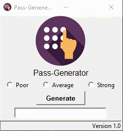
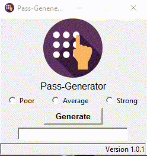

## Table of contents
* [General info](#general-info)
* [Technologies](#technologies)
* [Setup](#setup)
* [Sample](#sample)
	- [Version 1.0](#version-10)
	- [Version 1.0.1](#verion-101)

## General info
This project is Generating Random Password.
	
## Technologies
Project is created with:
* Python version: 3.8.5
* Tkinter Version: 8.6
* Pillow Version: 7.1.2 (For Images)
	
## Setup
To run this project, download it locally:

```
$ cd /file/path
$ py app.py
```

## Sample
### Version 1.0


### Version 1.0.1

